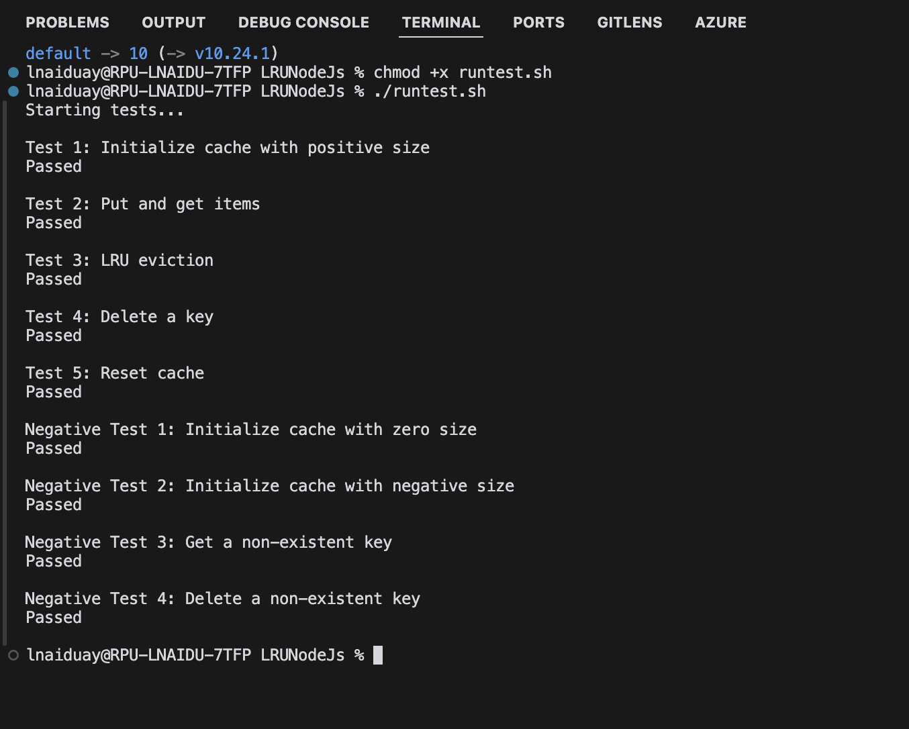

# LRUNodeJs

LRUNodeJs is a Node.js implementation of a Least Recently Used (LRU) cache. This project provides an efficient in-memory caching solution that automatically evicts the least recently used items when the cache reaches its capacity.

## Features

- In-memory LRU cache implementation
- Configurable cache size
- Basic operations: put, get, delete, and reset
- Automatic eviction of least recently used items
- Comprehensive test suite

## Installation

1. Clone the repository:
   ```
   git clone https://github.com/lohithrn/LRUNodeJs.git
   cd LRUNodeJs
   ```

2. Run the setup script to ensure Node.js is installed:
   ```
   chmod +x setup.sh
   ./setup.sh
   ```

## Running Tests

To run the test suite:

1. Make sure you have completed the installation steps above.

2. Run the test script:
   ```
   chmod +x runtest.sh
   ./runtest.sh
   ```

This will execute the test suite and display the results in your terminal.

Here's a screenshot of what you should see when running the tests:



## Usage

To use the LRU cache in your project, import the `LRUCacheInMemoryImpl` class:
